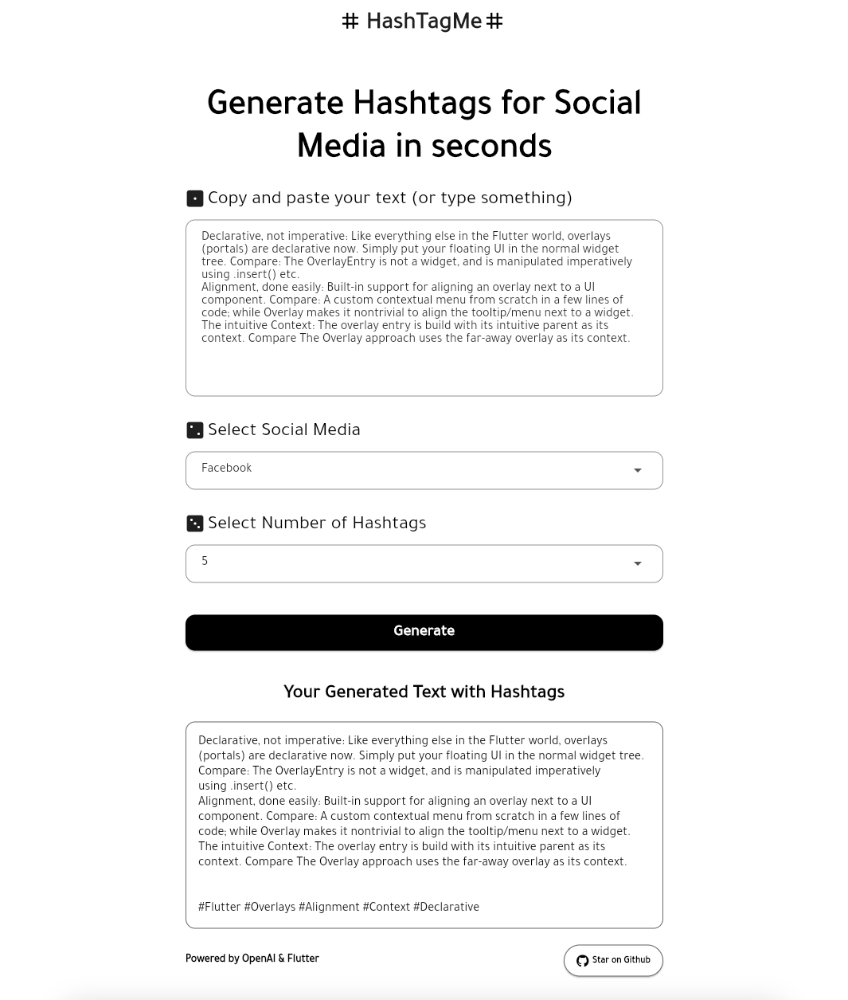

# hashtagme_openai
Generate hashtags for your text. Powered by OpenAI and Flutter

## How it works

This project uses the [OpenAI GPT-3 API](https://openai.com/api/) to constructs a prompt based on the user input, generates the response with hashtags and returns to the application with the original text. User can copy the resulted text. 

## Running

* After cloning the repo, Create .env file inside assets directory. 
* Go to [OpenAI](https://beta.openai.com/account/api-keys) to make an account and copy your API key.
* Put the api key in .env file as APIKEY = your_api_key

Then, run the application with `flutter run`.
